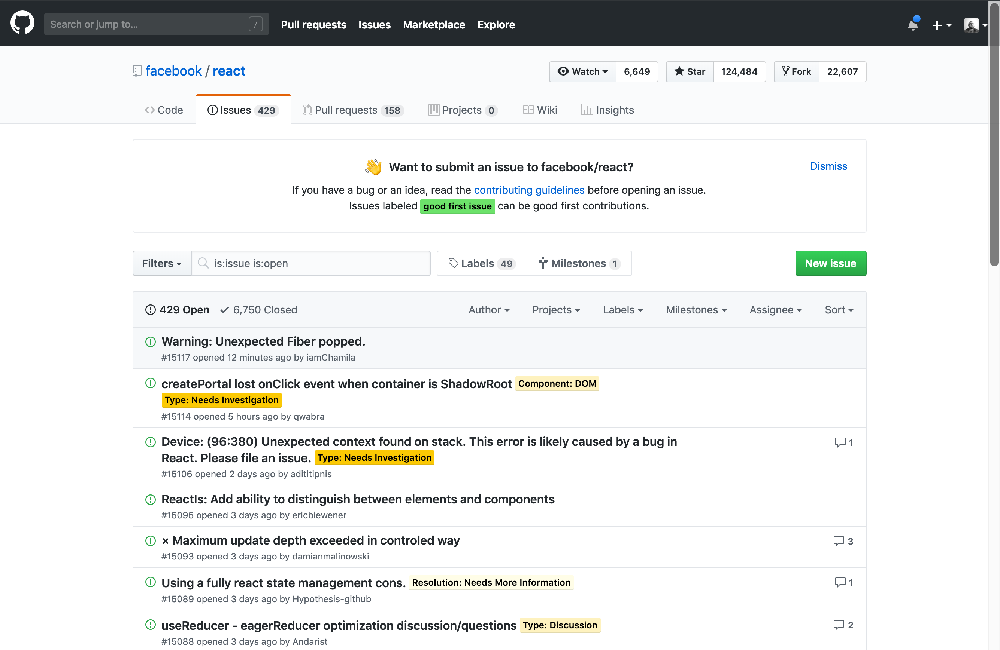
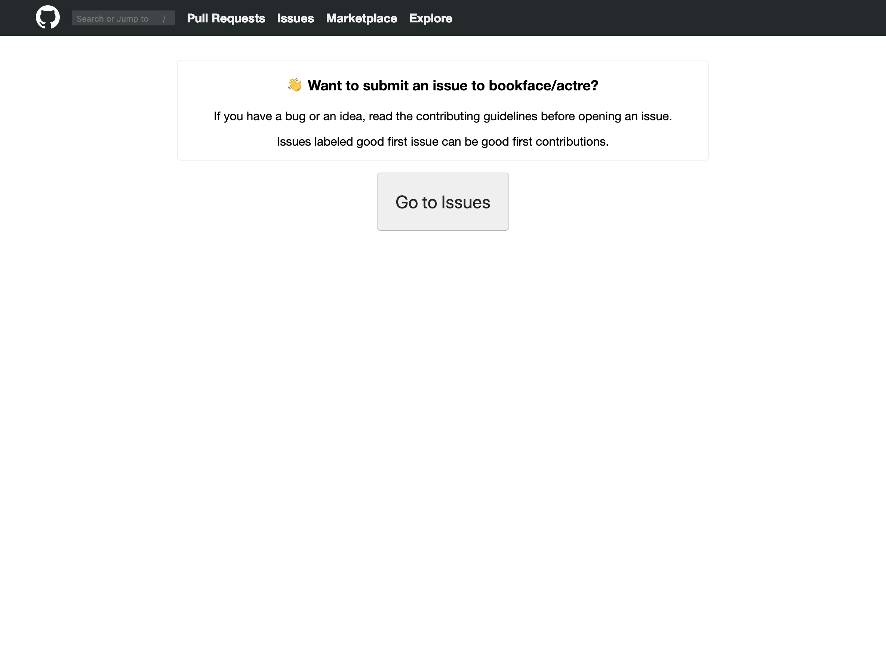
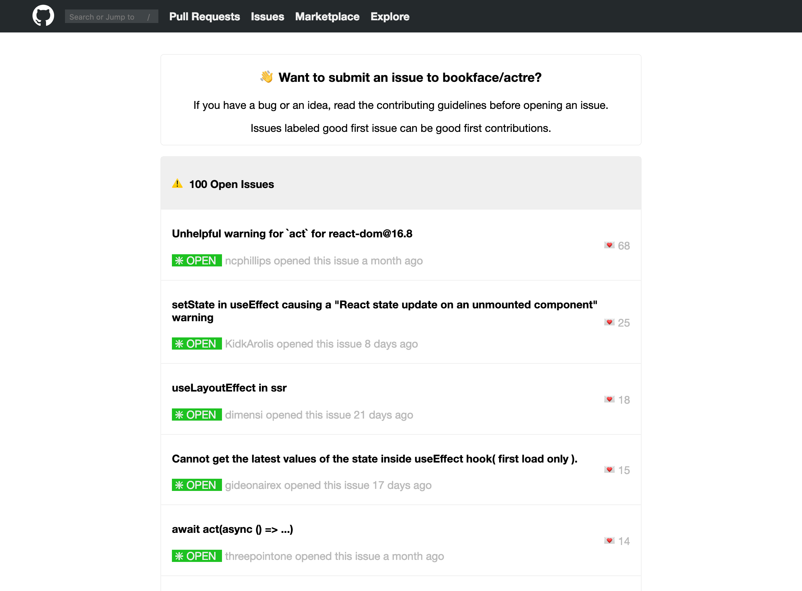
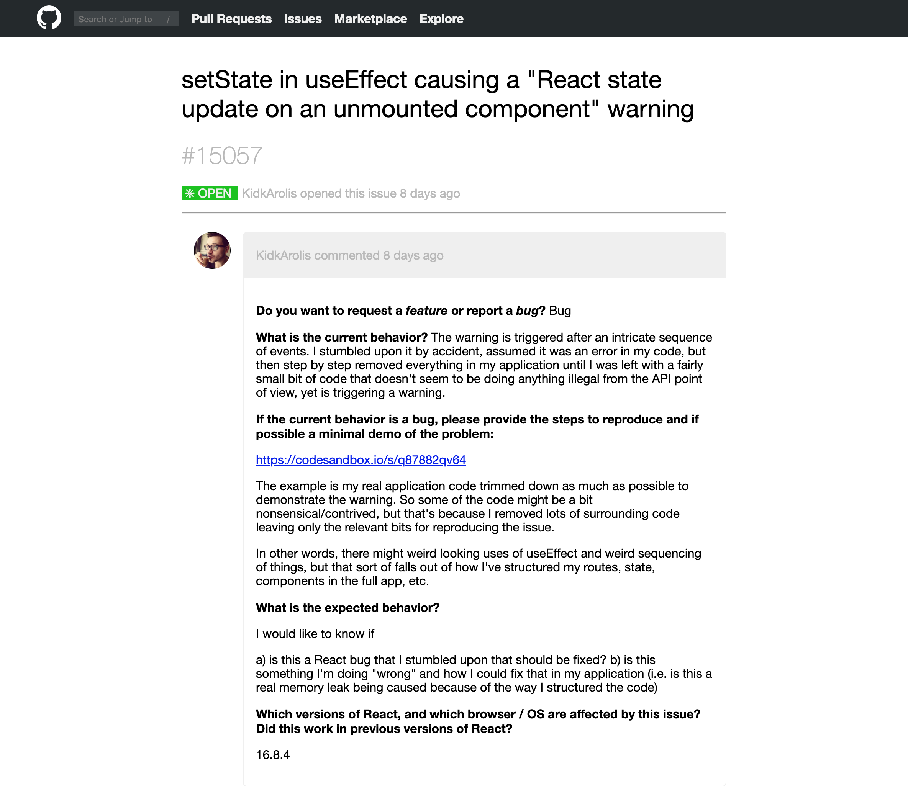

#  React Weekend - Github Issues Clone
___
## Objective
-  Build a _**simplified**_ clone of the [Github Issues pages](https://github.com/facebook/react/issues) for the _react_ repo Using **React**, **React Router** and the **Github API**


___
## Requirements
Your clone should have the following features:
  - a landing view with a link to 
  - an "index" view of open _issues_ for the repo
  - a "show" view to display the details for individual _issues_

Your app will use React Router to navigate between different views.

Your app will be styled to look somewhat like Github

_Strive to write Components that you can reuse in multiple places in your app_

### Example Deliverable:

**`/` - Landing**

**`/issues` - Index**

**`/issues/:id` - Show**

___
## Getting Started
- Use `create-react-app` to generate a new project called 'react-github-issues'
- Generate an empty repo on Github and hook up your local repo to the remote
- Study the examples and the [real live Github Issues page](https://github.com/facebook/react/issues) and review the [Thinking in React](https://reactjs.org/docs/thinking-in-react.html) article from the docs to come up with a solid plan for your components.
- No API keys are required to access the Github Issues endpoint located here `https://api.github.com/repos/facebook/react/issues?page=1&per_page=100`
    - [Github API Docs - Issues Endpoint](https://developer.github.com/v3/issues/)
    - Looks like the limit is a return of 100 issues per call
    - You are welcome to use the issues from another large repo if you would like to
- use `fetch` or install and use `axios`
- Install `react-router-dom`

___
## Tips & Tricks
### Moment.js
[Moment.js](https://momentjs.com/) offers an excellent set of utilities to deal with all that wibbly-wobbly, timey-wimey stuff that makes programming things that deal with time obnoxious. It can do powerful and amazing things... however, you may find the `.fromNow()` method helpful for this deliverable.

### react-markdown
The main content of an `Issue` returned from the API is comes back as stringified markdown. We can make use of the third-party utility package, `react-markdown`. 

```bash
$ npm install react-markdown
```
You can then use it within a component to parse the the markdown and display formatted text
```js
import React from 'react';
import ReactMarkdown from 'react-markdown';

const FormattedContent = props => {
  /* stuff */ 
  return (
    <ReactMarkdown source={props.markdownContent} />
  )
}

export default FormattedContent;
```
More Info can be found [here](https://github.com/rexxars/react-markdown).
___

If you get stuck, follow the principles of Read, Search, Ask. Review your labs, weekly deliverables and code-alongs. Remember to check the docs, google your question or ask a colleague. Happy hacking!

___
## Bonuses
Want more?
- Roll your own pagination scheme and only show 20 issues per page on the index view
- explore the FontAwesome Component library and use their icons in your app
- create methods to sort by number of comments, date etc...
- Explore `axios.all()` to bring in more issues with `?state=closed` appended to the query and make a filter to show closed issues
- find the Pull Requests API endpoint and extend your app to include them
___
## Licensing
1. All content is licensed under a CC-BY-NC-SA 4.0 license.
2. All software code is licensed under GNU GPLv3. For commercial use or alternative licensing, please contact legal@ga.co.